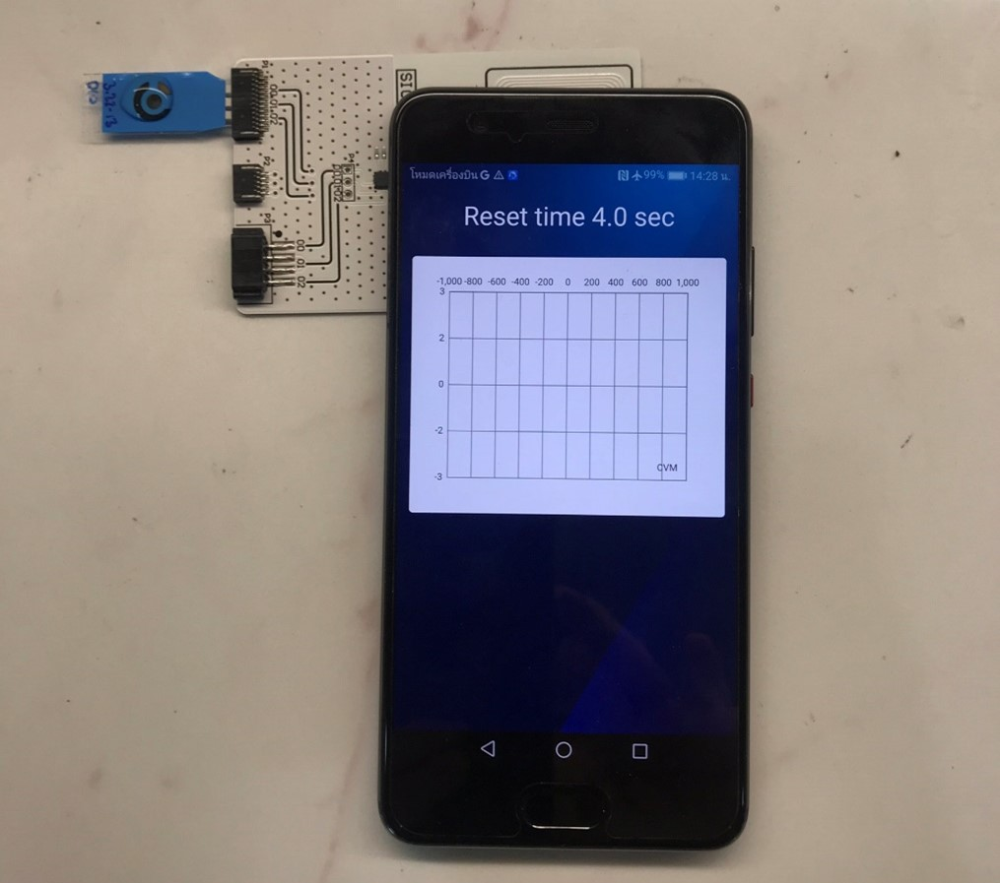
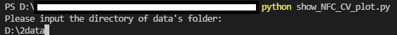
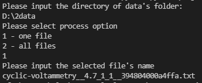
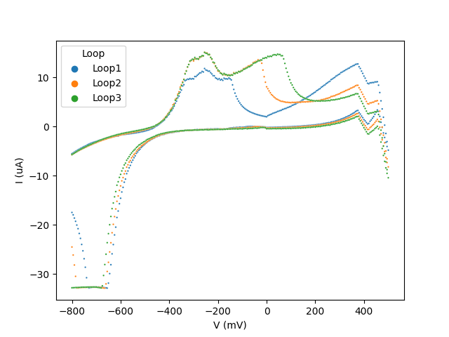
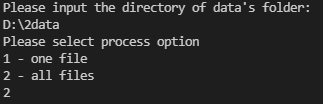
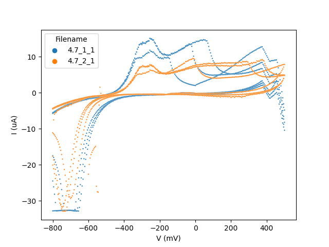

# SiliconCraft_NFC_CV_txt_reader

<!-- ABOUT THE PROJECT -->
## About The Project

<p align="center">

  </p>

After the NFC potentiostat perform electrochemical process the result can be show only in .txt format.
Therefore, this repository purpose is to help automate the process of viewing cyclic voltammogram from raw txt file of NFC portable potentiostat.


### Built With

* [seaborn](https://seaborn.pydata.org/index.html)
* [pandas](https://pandas.pydata.org/docs/index.html)

<!-- GETTING STARTED -->
## Getting Started

In order to use show_NFC_CV_plot.py to visualize cyclic voltammogram from raw txt file.
The following prerequisites are required.

### Prerequisites


* pandas
  ```sh
  pip install pandas
  ```
  
* seaborn
  ```sh
  pip install seaborn
  ```

<!-- USAGE EXAMPLES -->
## Usage

1. Run
  ```sh
  python show_NFC_CV_plot.py
  ```

2. Type the directory of data (Please make sure that there are only data file in that directory)
    

3. Choose plotting method between
3.1 Plot single data file
    
    This method will ask you to provide filename. (Please make sure you add .txt at the end) 
    
    
    This plot will display data of a single file with different color for each loop of cyclic voltammogram
    

3.2 Plot multiple data files
    This method will plot all data files in the directory with different color for each file
    
    <br>
    

<!-- CONTACT -->
## Contact

Narat M. - france.098@hotmail.com

Project Link: [https://github.com/NaratMa/SiliconCraft_NFC_CV_txt_reader](https://github.com/NaratMa/SiliconCraft_NFC_CV_txt_reader)


